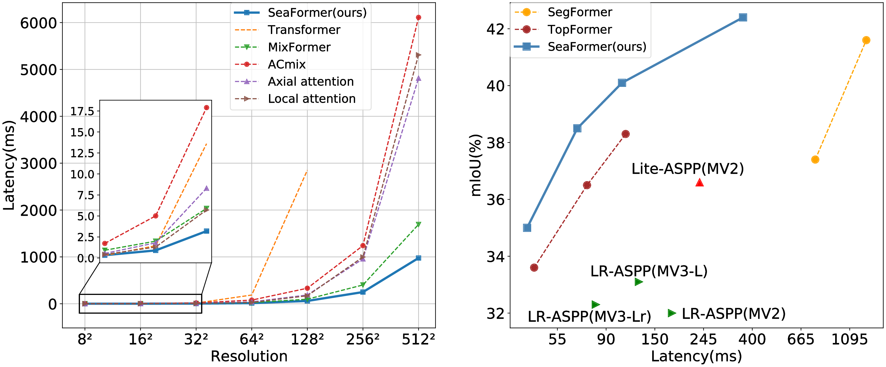
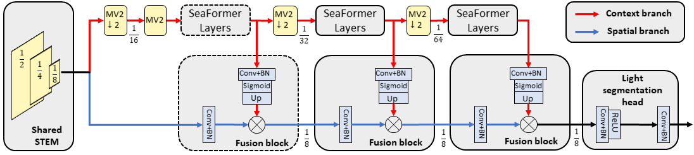
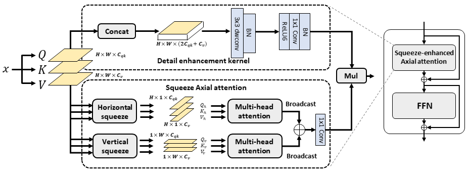

# Squeeze-enhanced axial Transformer
### [Paper](https://arxiv.org/abs/2301.13156)
> [**SeaFormer: Squeeze-enhanced Axial Transformer for Mobile Semantic Segmentation**](https://arxiv.org/abs/2301.13156),            
> Qiang Wan, Zilong Huang, Jiachen Lu, Gang Yu, Li Zhang        
> **ICLR 2023**

This repository contains the official implementation of SeaFormer.

## SeaFormer achieves superior trade-off between performance and latency
<div align="center">
  
</div>

## The overall architecture of Seaformer
<div align="center">
  
</div>

## The schematic illustration of the SeaFormer layer
<div align="center">
  
</div>

## Model Zoo

### Image Classification

Classification configs & weights see >>>[here](seaformer-cls/)<<<.

- SeaFormer on ImageNet-1K

| Model            | Size | Acc@1 | #Params (M) | FLOPs (G) |
|------------------|:----:|:-----:|:-----------:|:---------:|
| SeaFormer-Tiny   |  224 |  68.1 |     1.8     |    0.1    |
| SeaFormer-Small  |  224 |  73.4 |     4.1     |    0.2    |
| SeaFormer-Base   |  224 |  76.4 |     8.7     |    0.3    |
| SeaFormer-Large  |  224 |  79.9 |     14.0    |    1.2    |


### Semantic Segmentation

Segmentation configs & weights see >>>[here](seaformer-seg/)<<<.

- SeaFormer on ADE20K

| Method       |      Backbone    |   Pretrain  | Iters | mIoU(ss) |
|--------------|------------------|-------------|-------|----------|
|  Light Head  | SeaFormer-Tiny   | ImageNet-1K | 160K  | 36.5     |
|  Light Head  | SeaFormer-Small  | ImageNet-1K | 160K  | 39.4     |
|  Light Head  | SeaFormer-Base   | ImageNet-1K | 160K  | 41.9     |
|  Light Head  | SeaFormer-Large  | ImageNet-1K | 160K  | 43.8     |

- SeaFormer on Cityscapes

| Method         |      Backbone    |   FLOPs | mIoU |
|----------------|------------------|---------|----------|
|  Light Head(h) | SeaFormer-Small  |   2.0G  | 71.1     |
|  Light Head(f) | SeaFormer-Small  |   8.0G  | 76.4     |
|  Light Head(h) | SeaFormer-Base   |   3.4G  | 72.2     |
|  Light Head(f) | SeaFormer-Base   |   13.7G | 77.7     |


## Citation

```
@inproceedings{wan2023seaformer,
  title     = {SeaFormer: Squeeze-enhanced Axial Transformer for Mobile Semantic Segmentation},
  author    = {Wan, Qiang and Huang, Zilong and Lu, Jiachen and Yu, Gang and Zhang, Li},
  booktitle = {International Conference on Learning Representations (ICLR)},
  year      = {2023}
}
```

## Acknowledgment
Thanks to previous open-sourced repo:\
[TopFormer](https://github.com/hustvl/TopFormer)\
[mmsegmentation](https://github.com/open-mmlab/mmsegmentation)\
[pytorch-image-models](https://github.com/rwightman/pytorch-image-models)

